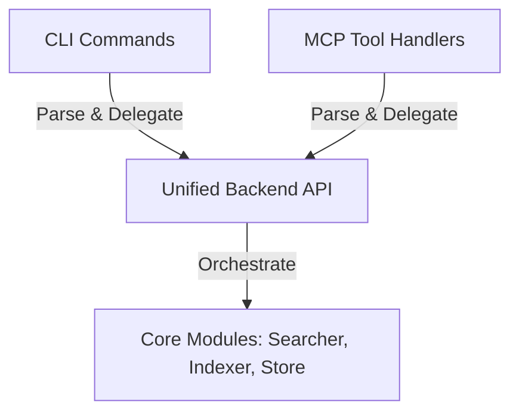

---
tags:
  - '#research'
  - '#cli-mcp-decoupling'
date: '2026-06-05'
modified: '2026-06-30'
related: []
---

# `cli-mcp-decoupling` research: `CLI and MCP Decoupling and Standardization`

This research covers the decoupling of CLI and MCP interfaces from core business logic, auditing existing entry points for layering violations, and defining a standardized architecture where all backend operations flow through a unified facade.

## Findings

### 1. Code Audit of CLI Layer (`src/vaultspec_rag/cli/`)

A review of the CLI module group reveals several active business logic and orchestration leaks that do not delegate to the backend facade:

- **`src/vaultspec_rag/cli/_benchmark.py`**:

  - Direct dependency on `EmbeddingModel`, `VaultSearcher`, and `_open_vault_store`.
  - Manages its own warm-up queries, times search latency, sorts percentile arrays, and computes mean and standard deviations.
  - Direct invocation of `torch.cuda` memory probes.
  - **Remediation**: Extract latency benchmarking logic into a new backend API function in `src/vaultspec_rag/api.py` (e.g. `run_benchmark`).

- **`src/vaultspec_rag/cli/_quality.py`**:

  - Direct dependencies on `EmbeddingModel`, `VaultIndexer`, `VaultSearcher`, and `_open_vault_store`.
  - Orchestrates the synthetic corpus generation, runs full indexing, loops over search needles, and calculates precision statistics.
  - Asserts the 75% quality pass/fail threshold.
  - **Remediation**: Extract synthetic quality testing logic into a new backend API function in `src/vaultspec_rag/api.py` (e.g. `run_quality_probe`).

- **`src/vaultspec_rag/cli/_test.py`**:

  - Directly constructs pytest arguments and executes subprocesses.
  - **Remediation**: Delegate to a backend runner function.

### 2. Code Audit of MCP Layer (`src/vaultspec_rag/mcp_server/`)

The MCP layer was recently refactored to delegate tool calls to `src/vaultspec_rag/api.py` and `src/vaultspec_rag/jobs.py`. However, additional opportunities exist to enforce absolute parity:

- **Admin Tools (`src/vaultspec_rag/mcp_server/_admin_tools.py`)**:
  - Observability functions like `get_service_state` package and format internal dictionaries directly. This logic should be standardized under unified backend status functions in the core library so the CLI and MCP can query identical payloads.
- **Tool Parity**:
  - Observation and benchmark tools (`benchmark`, `quality`) are currently CLI-only. By moving their orchestration to the core backend, they can easily be exposed as MCP tools under a unified schema.

### 3. Decoupling & Parity Architecture

The architecture will follow a strict delegation pattern:

- **CLI Commands** will limit their scope to Typer parsing, confirm prompts, formatting tables, and JSON serialization.
- **MCP Handlers** will limit their scope to JSON-RPC parameter validation, exception translation, and JSON formatting.
- **Backend API** (`src/vaultspec_rag/api.py` and matching domain modules) will encapsulate all indexing, searching, benchmarking, quality checks, and system diagnostics.
