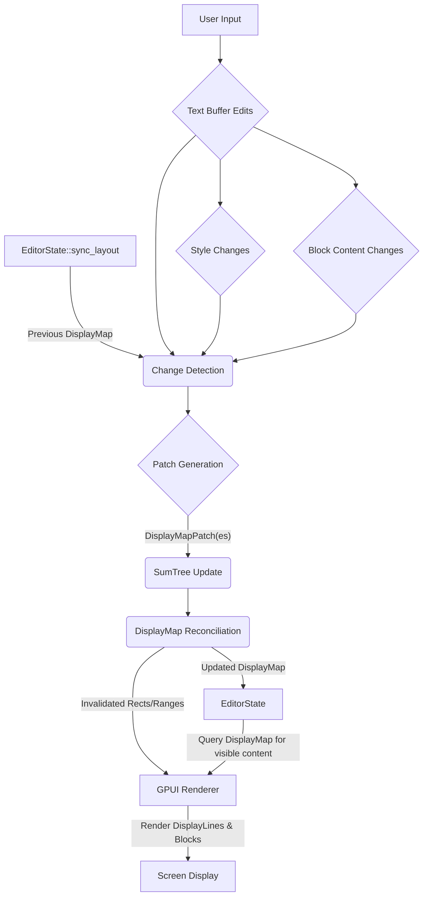

---
tags:
  - "#adr"
  - "#incremental-layout-engine"
date: 2026-02-06
related:
  - "[[2026-02-06-incremental-layout-engine-design-adr]]"
  - "[[2026-02-04-adopt-zed-displaymap-adr]]"
  - "[[2026-02-06-incremental-layout-engine-research]]"
  - "[[2026-02-06-editor-audit-reference]]"
---

# DisplayMap Architecture and Patch System Design for Incremental Layout Engine

## 1. Introduction

This document details the design of the `DisplayMap` architecture and its associated `Patch` system, forming the core of the incremental layout engine for the editor. The primary objective is to address the performance bottlenecks identified in `EditorState::sync_layout`, which currently performs full layout recalculations, leading to poor responsiveness for large documents and complex features like Markdown live preview.

Inspired by Zed's highly performant editor architecture, this design leverages concepts such as the `DisplayMap` for visual representation, `SumTree` for efficient metric aggregation and querying, and a `Patch` system for propagating incremental changes.

**Goals of the Incremental Layout Engine:**

* **Significant Performance Improvement:** Achieve measurable performance gains for large documents and frequent real-time updates.
* **Enhanced User Experience:** Provide a smoother, more fluid, and responsive editing experience.
* **Scalability for Rich Content:** Enable seamless integration and efficient rendering of dynamic content blocks, crucial for features like Markdown live preview.
* **Efficient Resource Utilization:** Minimize CPU cycles and memory overhead by performing localized updates.

## 2. DisplayMap Internal Structure

The `DisplayMap` is a central data structure responsible for representing the visual layout of the document. It acts as an abstraction layer between the raw text buffer and the rendered output, integrating various display-related concerns like text styling, line breaks, and custom content blocks.

### 2.1. Layers/Hierarchy (Conceptual, Inspired by Zed)

While the full Zed `DisplayMap` involves multiple layers (`Inlay`, `Fold`, `Tab`, `Wrap`, `Block`), our initial implementation will focus on the `BlockMap` for Markdown live preview. The other layers are acknowledged for future integration:

* **Buffer:** The underlying raw text content (`rope::Rope` or similar).
* **InlayMap:** (Future) Handles inline hints and decorations that don't affect line breaks.
* **FoldMap:** (Future) Manages code folding, collapsing multiple lines into one display line.
* **WrapMap:** (Future) Manages soft line wrapping, breaking long logical lines into multiple display lines.
* **BlockMap:** Manages custom, embedded content blocks that occupy vertical space within the text flow. This will be the initial focus to support Markdown live preview.

### 2.2. Core Component: SumTree for Layout Metrics

A `SumTree` will be the foundational data structure within the `DisplayMap` (and its sub-components like `BlockMap`) for efficiently storing and querying layout-related metrics. It allows for rapid determination of visible ranges, impact of localized changes, and efficient coordinate conversions.

#### 2.2.1. SumTree Structure

A `SumTree` is a balanced binary tree where each node stores a `Summary` of its children's data. Leaf nodes represent individual elements, and internal nodes aggregate the summaries of their descendants.

* **Element:** Represents a unit of content in the `DisplayMap`. For example, a `DisplayLine` or a `Block`. An element will contain its own metrics (e.g., height, character count).
* **Summary:** An aggregated value of all elements within the subtree rooted at a given node. For the `DisplayMap`, a `Summary` might include:
  * `line_count`: Total number of display lines.
  * `height`: Total vertical height in pixels.
  * `char_count`: Total visible characters.
  * `block_count`: Total number of custom blocks.

#### 2.2.2. SumTree Operations

The `SumTree` provides efficient logarithmic time complexity for:

* **Insertion/Deletion:** Adding or removing elements only requires updating the summaries along the path from the modified leaf to the root.
* **Range Queries:** Quickly find elements within a given range (e.g., "get all elements between Y-pixel 100 and 200").
* **Index Conversion:** Convert between buffer indices, display line numbers, and pixel offsets efficiently.

#### 2.2.3. DisplayMap and SumTree Interaction

The `DisplayMap` will encapsulate a `SumTree` where each element in the `SumTree` represents a `DisplayLine` or a `Block`.

* **`DisplayLine`:** Represents a single visual line of text, potentially corresponding to a portion of a logical line (due to wrapping) or a full logical line. It will carry metrics like its rendered height, start/end buffer offsets, and visual character length.
* **`Block`:** Represents a custom content block (e.g., a rendered Markdown image or code block). It will carry its rendered height and its associated buffer range.

The `SumTree` will aggregate the `height` and `line_count` (for `DisplayLine`s) or `block_count` (for `Block`s) to allow for efficient queries about the total height or line count of a given display range.

## 3. Patch Data Structure for Incremental Updates

The `Patch` data structure is designed to represent incremental changes to the `DisplayMap` concisely, enabling efficient updates without rebuilding the entire structure. This is analogous to text diffing but applied to the visual representation.

### 3.1. Structure of a `Patch`

A `Patch` will encapsulate the location and nature of a change. It typically includes:

```rust
pub struct DisplayMapPatch {
    pub start_display_point: DisplayPoint, // Where the change begins in display coordinates
    pub old_content_len: Length,          // Length of content removed (in display lines/blocks/chars)
    pub new_content: Vec<DisplayMapElement>, // New elements to insert (DisplayLine or Block)
    // Additional metadata for SumTree updates, like total height change
}

// DisplayPoint could be (row, column) in display space, or an absolute index in the SumTree
pub struct DisplayPoint {
    pub row: usize,
    pub column: usize,
}

// A common enum for elements in the SumTree
pub enum DisplayMapElement {
    Line(DisplayLine),
    Block(Block),
}

// A Length enum might be useful to express removed/added content in different metrics
pub enum Length {
    Lines(usize),
    Chars(usize),
    Pixels(f32),
}
```

### 3.2. Types of Patches

Patches can represent various types of modifications:

* **Insertion:** `old_content_len` is zero, `new_content` contains elements to add.
* **Deletion:** `old_content_len` is non-zero, `new_content` is empty.
* **Replacement:** `old_content_len` is non-zero, `new_content` contains elements to replace the old content.
* **Attribute Change:** A specific type of patch might represent only a change in attributes (e.g., style, height) of existing elements without changing their count or position. This would typically involve replacing an element with a modified version.

## 4. Incremental Algorithm Design (`EditorState::sync_layout` Refactor)

The `EditorState::sync_layout` function will be refactored to implement the incremental layout algorithm. Its core responsibility will be to detect changes, generate corresponding `DisplayMap` patches, apply these patches to the internal `SumTree` and `DisplayMap` state, and signal necessary UI redraws.

### 4.1. Input

The `sync_layout` function will take:

* The current `EditorState`, which includes:
  * The underlying text `Buffer` (e.g., `rope::Rope`).
  * Current styling information.
  * Information about active `Block`s (e.g., parsed Markdown blocks and their associated buffer ranges).
  * The previous `DisplayMap` state (including its `SumTree`).
* Potentially, a `Viewport` definition to optimize calculations for only visible areas.

### 4.2. Change Detection

This is a critical step, comparing the current state with the previous state to identify what has changed.

1. **Text Edits (Buffer Changes):**
    * Leverage the `rope::Rope`'s efficient diffing capabilities. When the underlying buffer changes, `sync_layout` receives a set of `TextEdit`s (range, new text).
    * These buffer changes need to be translated into affected `DisplayMap` regions.

2. **Style Changes:**
    * If styling rules change (e.g., syntax highlighting updates), entire ranges of `DisplayLine`s might need re-layout.
    * This could be triggered explicitly or implicitly by text changes affecting scopes.

3. **Block Modifications/Insertions/Deletions:**
    * Changes to Markdown source could lead to new blocks appearing, existing blocks changing type/content, or blocks being removed.
    * The `BlockMap` component will detect these changes based on the updated parsed document structure and generate `Block`-specific updates.

### 4.3. Patch Generation

Once changes are detected, `sync_layout` will generate one or more `DisplayMapPatch`es.

* **Text Insertions/Deletions:**
  * Buffer `TextEdit`s are mapped to `DisplayPoint`s in the previous `DisplayMap`.
  * New `DisplayLine`s are constructed (potentially using the `TextLayout` trait) for the inserted/modified text.
  * A `DisplayMapPatch` (e.g., `(start_dp, old_len, new_lines)`) is generated.

* **Style Changes:**
  * For ranges where styling has changed but text content is the same, `DisplayLine`s within that range are re-laid out to get new heights/widths/visual representations.
  * A `Replacement` patch is generated, replacing old `DisplayLine`s with new ones.

* **Block Changes (via `BlockMap`):**
  * When a Markdown block is inserted: A `Block` element is created with its calculated height, and an `Insertion` patch is generated.
  * When a Markdown block is deleted: A `Deletion` patch is generated for the `Block` element.
  * When a Markdown block's content or rendering changes (affecting its height): A `Replacement` patch is generated for the `Block` element.

### 4.4. SumTree Update

Each generated `DisplayMapPatch` will be applied to the `SumTree` instance within the `DisplayMap`.

* The `SumTree` updates its aggregated `Summary` values (height, line_count, etc.) along the path from the modified leaves to the root.
* This ensures that all range queries and coordinate conversions remain accurate after the change, with minimal computation.

### 4.5. DisplayMap Reconciliation

After `SumTree` updates, the `DisplayMap`'s actual collection of `DisplayLine`s and `Block`s is reconciled according to the patches. This might involve:

* Removing old `DisplayMapElement`s.
* Inserting new `DisplayMapElement`s.
* Updating properties of existing `DisplayMapElement`s.

### 4.6. Output

The `sync_layout` function will return:

* The new, updated `DisplayMap` state.
* A list of invalidated screen `Rect`s (or `DisplayPoint` ranges) that need to be redrawn by the GPUI renderer. This allows for partial screen updates, further optimizing rendering performance.

## 5. Interface Contracts and Data Flow

This section defines the key interfaces and how data flows between different components, ensuring modularity and adherence to the framework-agnostic nature of `pp-editor-core`.

### 5.1. `pp-editor-core` (Framework Agnostic)

This crate will define the core logic and traits.

* **`TextLayout` Trait:**

    ```rust
    pub trait TextLayout: Send + Sync + 'static {
        type FontId: Copy + Eq + Hash + Clone + Send + Sync + Debug; // Abstract font ID
        type LineLayout: TextLine; // Abstract type representing a laid out line

        fn layout_line(
            &self,
            text: &str,
            font_id: Self::FontId,
            font_size: f32,
            max_width: f32, // Used for soft wrapping calculations
            tab_size: u8,
            // Additional styling information (e.g., color, decorations)
            // This could be passed as a slice of (Range<usize>, TextDecoration) tuples
            // or a dedicated struct for line-level styling.
        ) -> Self::LineLayout;

        fn line_height(&self, font_id: Self::FontId, font_size: f32) -> f32;

        // TODO: Add methods for hit-testing, cursor position calculation, character width, etc.
        // These are crucial for editor functionality and coordinate conversions.
    }

    // `TextLine` Trait (New):
    // This new trait represents the results of a text layout operation for a single line,
    // providing necessary metrics.
    pub trait TextLine: Send + Sync + 'static {
        /// Returns the visual width of the laid out line.
        fn width(&self) -> f32;
        /// Returns the height of the laid out line.
        fn height(&self) -> f32;
        /// Returns the number of grapheme clusters in the line.
        fn len(&self) -> usize;
        /// Returns true if the line contains no grapheme clusters.
        fn is_empty(&self) -> bool;
        // TODO: Add methods for character-to-pixel conversion, pixel-to-character conversion,
        // and potentially glyph information for rendering.
    }
    ```

* **`DisplayMap` Trait/Interface:**

    ```rust
    // The primary structure managed by EditorState::sync_layout
    pub struct DisplayMap {
        pub sum_tree: SumTree<DisplayMapElement>, // Stores DisplayLine and Block elements
        // ... potentially other state like scroll position, viewport info
    }

    // Methods on DisplayMap for querying:
    impl DisplayMap {
        fn display_point_to_buffer_point(&self, dp: DisplayPoint) -> BufferPoint;
        fn buffer_point_to_display_point(&self, bp: BufferPoint) -> DisplayPoint;
        fn visible_lines_in_viewport(&self, viewport: Rect) -> impl Iterator<Item = &DisplayMapElement>;
        // ... methods for applying patches internally
    }
    ```

* **`BlockContent` Trait:**

    ```rust
    pub trait BlockContent: Send + Sync + 'static {
        // Unique identifier for the block type, allows different rendering strategies
        fn block_type_id(&self) -> TypeId;
        // The buffer range this block is conceptually associated with
        fn buffer_range(&self) -> Range<BufferPoint>;
        // A method to calculate its intrinsic height based on content and available width
        fn calculate_height(&self, available_width: f32, layout_context: &dyn LayoutContext) -> f32;
        // A method to render the block (will be called by the UI layer)
        // This might return a GPUI element or some serializable representation
    }

    // Example implementation for MarkdownBlock
    pub struct MarkdownBlock { /* ... parsed markdown AST, etc. */ }
    impl BlockContent for MarkdownBlock { /* ... */ }
    ```

* **`Buffer`:** The text buffer (`rope::Rope`) will provide APIs for content, text edits, and potentially change notifications.

### 5.2. `pp-ui-core` (GPUI Specific Adapter)

This crate will provide GPUI-specific implementations.

* **`GpuiTextLayout` Implementation:**

    ```rust
    // In pp-ui-core/src/gpui_text_layout.rs
    pub struct GpuiTextLayout { /* ... gpui::TextSystem instance, font cache ... */ }

    impl TextLayout for GpuiTextLayout {
        type FontId = gpui::FontId; // Concrete GPUI FontId
        type LineLayout = gpui::LineLayout; // Concrete GPUI LineLayout

        fn layout_line(/* ... */) -> gpui::LineLayout { /* ... use gpui::TextSystem ... */ }
        fn line_height(/* ... */) -> f32 { /* ... */ }
    }
    ```

* **DisplayMap Renderer:** A component within `pp-ui-core` that knows how to interpret the `DisplayMap` and render its `DisplayLine`s (using `GpuiTextLayout`) and `Block`s (by invoking their rendering logic or mapping them to GPUI elements) using GPUI's rendering primitives.

### 5.3. Data Flow Diagram (Conceptual)



## 6. Markdown Live Preview Integration (BlockMap Focus)

The `BlockMap` is the key component for enabling Obsidian-like Markdown live preview. It will manage the insertion, layout, and updates of rendered Markdown elements as `Block`s within the `DisplayMap`.

* **`MarkdownBlock`:** An implementation of `BlockContent` that holds the parsed representation of a Markdown element (e.g., an image, a code block, a heading). Its `calculate_height` method will determine the vertical space required based on its content and the available width.
* **Parsing and Block Creation:** A Markdown parser will analyze the buffer content. When it identifies a renderable Markdown element, it will create a `MarkdownBlock` instance and associate it with a specific buffer range.
* **BlockMap Management:** The `BlockMap` (as part of the overall `DisplayMap`'s `SumTree`) will manage these `Block` elements. When a `MarkdownBlock` is inserted or its content/height changes, the `BlockMap` generates a `DisplayMapPatch` that the `SumTree` then processes to update the overall vertical layout.
* **Rendering:** The `DisplayMap` renderer in `pp-ui-core` will recognize `Block` elements. For `MarkdownBlock`s, it will invoke their rendering logic (or map them to corresponding GPUI components) to display the rich content.

## 7. Future Work/Phased Implementation

* **WrapMap Integration:** Implement soft line wrapping by calculating wrap points for `DisplayLine`s and splitting them into multiple `DisplayLine` elements within the `SumTree`.
* **FoldMap Integration:** Implement code folding by collapsing ranges of `DisplayLine`s into a single `FoldedLine` element within the `SumTree`.
* **InlayMap Integration:** Handle smaller inline decorations that don't affect line breaks but need to be precisely positioned.
* **Selection and Cursor Logic:** Adapt selection and cursor movement to correctly navigate the `DisplayMap`'s coordinate spaces (buffer, display line, block).
* **Performance Benchmarking:** Establish robust benchmarks to measure the performance gains and identify further optimizations.
